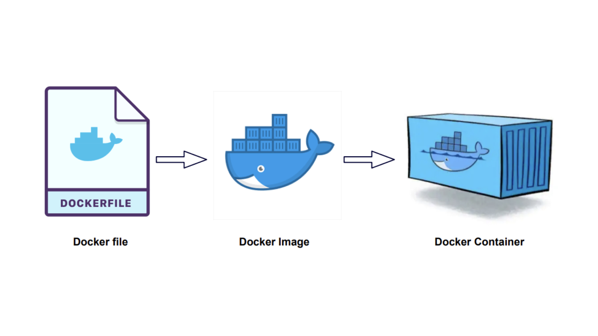
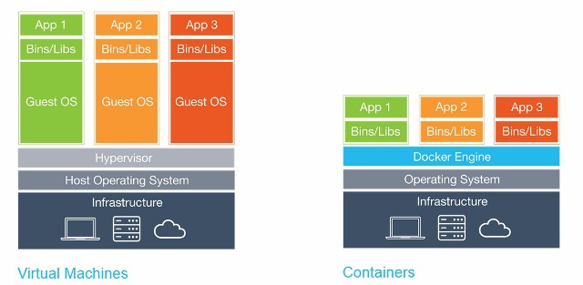

docker project 생성

- **requirements.txt**: 애플리케이션 실행에 필요한 패키지 목록.
- **requirements.dev.txt**: 개발 환경에서만 필요한 패키지 목록.
- **Dockerfile**: Docker 이미지를 빌드하기 위한 명령어 모음.
- **docker-compose.yml**: 여러 컨테이너를 정의하고 관리하기 위한 설정 파일.

도커파일과 이미지 파일, 컨테이너의 그림적 설명

- **Docker 이미지 (Docker Image)**: 정적이고 읽기 전용인 템플릿입니다. 애플리케이션과 그 종속성, 설정 등을 포함하고 있으며, 이를 기반으로 컨테이너를 생성합니다.
- **Docker 컨테이너 (Docker Container)**: Docker 이미지를 기반으로 실행된 인스턴스입니다. 컨테이너는 이미지의 실행 가능한 독립된 사본으로, 애플리케이션이 실제로 실행되는 환경입니다.

주제 

1. **도커는 무엇이고, 어떻게, 왜 사용하는것인가?**
2. **Docker랑 virtual machine의 다른점은 무엇인가?**
3. **그럼 쿠버네티스랑 도커는 어떤 관계가 있는 것인가?**

### 1. Docker는 무엇이고, 어떻게, 왜 사용하는 것인가?

- docker은 container이라는 instance를 만들어 내는 것.
- docker.image를 이용해서 container를 찍어내는 것
- 이 docker은 각각의 인스턴스에 독립된 환경이 조성되고 다른 환경을 갖는 개발자들이
    
    컨테이너를 사용하면 동일한 개발 환경에서 애플리케이션을 개발하는 편리함이 있음
    

우리는 이것과 비슷한걸 하나 알고있다. 

ec2에서도 사용한 가상환경 virtual enviroment 

### 2. Docker랑 virtual machine의 다른점은 무엇인가?

가상환경은 넓은 범주의 개념이다. 그 안에는 

가상환경 =  [ container, virtual machine, env ] etc.. 

컨테이너와 vm이 포함되어있다. 

그럼 가상환경안에 container와  vm 은 무엇이 다른건가?

container vs virtual machine

vm 

- 인스턴스에 각각의  Guest os를 포함하고 있음
- hypervisor를 통해 관리되며 host os 로부터 완전격리된 상태를 유지함
- 리소스를 많이 사용한다는 단점이 있음

docker

- docker engine에 깔려있는 리눅스 기반의 호스트 os를 공유하는 방식
- engine를 통해 관리되며 host os 를 공유하기때문에 완전격리라고 볼 수 없음
- 리소스를 효율적으로 사용함

- 질문 1. docker는 무조건 vm보다 좋다고 할 수 있는가?
    
    no
    
    ### **1. Windows 기반 레거시 애플리케이션:**
    
    - **사례**: 금융기관에서 사용하는 오래된 대출 시스템이 Windows XP 운영 체제를 기반으로 한다고 가정
    - **문제**: 도커는 Linux 기반 운영 체제에서만 실행될 수 있기 때문에 이 시스템을 Docker 컨테이너로 직접 실행할 수 없습니다.
    - **해결책**: 이 경우 가상 머신에 Windows XP를 설치하고 그 안에 대출 시스템을 실행합니다. 가상 머신은 독립적인 운영 체제를 제공하기 때문에 호스트 운영 체제와 레거시 애플리케이션을 격리하여 보안을 강화하고 호환성 문제를 방지할 수 있습니다.
    
    ### **2. 특정 하드웨어를 요구하는 레거시 애플리케이션:**
    
    - **사례**: 의료 영상 분석 소프트웨어가 특정 모델의 의료 영상 장치와 직접 연결되어야 한다고 가정しましょう.
    - **문제**: 도커 컨테이너는 일반적으로 호스트 시스템의 하드웨어 리소스에 제한된 액세스만 제공합니다.
    - **해결책**: 이 경우 가상 머신에 운영 체제와 의료 영상 분석 소프트웨어를 설치하고, 가상 머신에 의료 영상 장치를 직접 연결합니다. 가상 머신은 하드웨어에 대한 완벽한 액세스를 제공하여 레거시 애플리케이션이 제대로 작동하는 데 필요한 모든 리소스를 사용할 수 있도록 합니다.
    
    ### **3. 복잡한 네트워크 구성이 필요한 레거시 애플리케이션:**
    
    - **사례**: ERP 시스템이 여러 서버에 분산되어 있고 서로 복잡하게 네트워킹되어 있다고 가정しましょう.
    - **문제**: 도커 컨테이너 네트워킹은 기본적인 네트워킹 기능만 제공하며, 복잡한 네트워크 구성을 지원하지 못합니다.
    - **해결책**: 이 경우 가상 머신에 운영 체제와 ERP 시스템을 설치하고, 가상 머신 간에 필요한 네트워크 구성을 수동으로 설정합니다. 가상 머신은 네트워크 레벨에서 완벽한 제어를 제공하여 레거시 애플리케이션의 네트워킹 요구 사항을 충족시킬 수 있도록 합니다.
    
    ### **4. 라이센스 문제가 있는 레거시 애플리케이션:**
    
    - **사례**: 레거시 애플리케이션이 특정 서버에 라이센스되어 있고, 라이센스가 서버 하드웨어에 바인딩되어 있다고 가정しましょう.
    - **문제**: 도커 컨테이너는 일반적으로 라이센스가 서버 하드웨어가 아닌 컨테이너 이미지에 바인딩되어 있기 때문에 이러한 유형의 라이센스를 지원하지 않습니다.
    - **해결책**: 이 경우 가상 머신에 운영 체제와 레거시 애플리케이션을 설치하고, 라이센스를 가상 머신에 활성화합니다. 가상 머신은 라이센스를 하드웨어에 바인딩하는 기존 라이센싱 시스템과 호환되도록 합니다.
    
    위와 같은 경우에는 VM이 도커보다 레거시 애플리케이션을 실행하는 데 더 적합한 선택입니다.
    
- 질문 2. linux os를 기반으로하면 docker engine이 안필요한거 아닌가?
    
    아니다. 리눅스 os 자체는 있어도 
    
    컨테이너 관리, 이미지 관리, 네트워킹, 리소스 격리 등의 기능을 제공이 없기 때문에 도커엔진을 사용해야한다. 
    
- 질문 3. 호스트의 컴퓨터 리소스를 사용한다고 했으면 한 컨테이너가 리소스를 지나치게 사용하면 다른 컨테이너들은 리소스가 부족한거 아닌가?
    
    정답. 도커는 컨테이너에 트래픽이 몰리거나 할 때 새로운 컨테이너를 만들 수 있다. 하지만 호스트 os 물리적 지원 총량을 벗어나서 오면 성능저하가 올 수 밖에 없음. 이건 가상 환경의 공통적인 문제.
    
    컨테이너별 리소스를 제한 시켜서 사용할 수 있고 로드밸런싱도 가능하다. 
    

 

### 3. 그럼 쿠버네티스랑 도커는 어떤 관계가 있는 것인가?

쿠버네티스  - 도커의 컨테이너를 관리하는 오픈소스 플랫폼

**쿠버네티스와 도커 비교**

✔ 컨테이너 하나 띄어서 사용해야지 → 도커

✔ 0월 0시에 100개의 컨테이너를 자동으로 사용해야지 → 쿠버네티스

✔ 간단 설명

- 도커는 **'기술적인 개념이자 도구'**
- 쿠버네티스는 **'도커를 관리하는 툴'**
- 이미지를 컨테이너에 띄우고 실행하는 기술이 도커
- 이런 도커를 기반으로 컨테이너를 관리하는 서비스가 쿠버네티스라고 생각할 것
- **도커는 한 개의 컨테이너**를 관리하는 데 최적. **쿠버네티스는 여러개의 컨테이너를 서비스 단위로 관리하는데 최적화** 되어 있음

출철 : [https://velog.io/@kureungkureung/도커와-쿠버네티스](https://velog.io/@kureungkureung/%EB%8F%84%EC%BB%A4%EC%99%80-%EC%BF%A0%EB%B2%84%EB%84%A4%ED%8B%B0%EC%8A%A4)